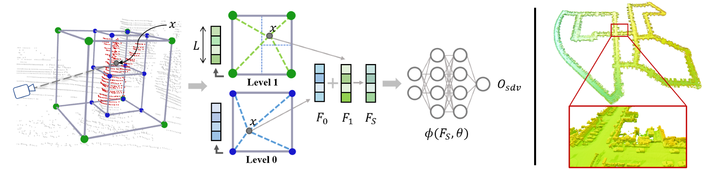

# ✨ SHINE-Mapping: Large-Scale 3D Mapping Using Sparse Hierarchical Implicit Neural Representations
This repository contains the implementation of the paper:

Large-Scale 3D Mapping Using **S**parse **H**ierarchical **I**mplicit **NE**ural Representations.

Xingguang Zhong, Yue Pan, Jens Behley and Cyrill Stachniss

[Link]() to the arXiv version of the paper will be available soon.

----

## Demo Video

Coming soon.

## Abstract

Accurate mapping of large-scale environments is an essential building block of most outdoor autonomous systems. Challenges of traditional mapping methods include the balance between memory consumption and mapping accuracy. This paper addresses the problems of achieving large-scale 3D reconstructions with implicit representations using 3D LiDAR measurements. We learn and store implicit features through an octree-based hierarchical structure, which is sparse and extensible. We leverage binary cross entropy loss to optimize the local features with the 3D measurements as supervision. Based on our implicit representation, we design an incremental mapping system with regularization to tackle the issue of catastrophic forgetting in continual learning. Our experiments show that our 3D reconstructions are more accurate and complete than current state-of-the-art 3D mapping methods. Furthermore, our approach has smaller memory usage.

## Codes
Coming soon.

